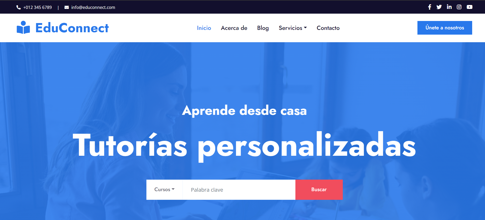
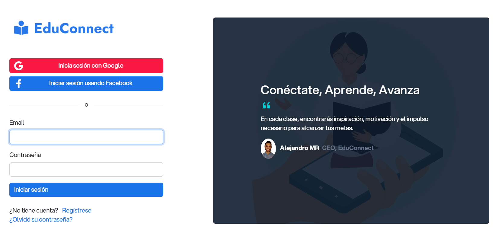
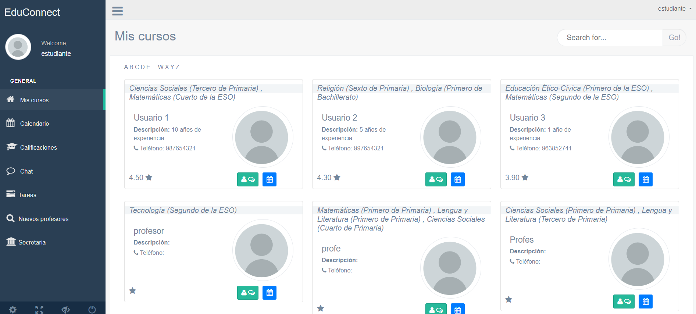
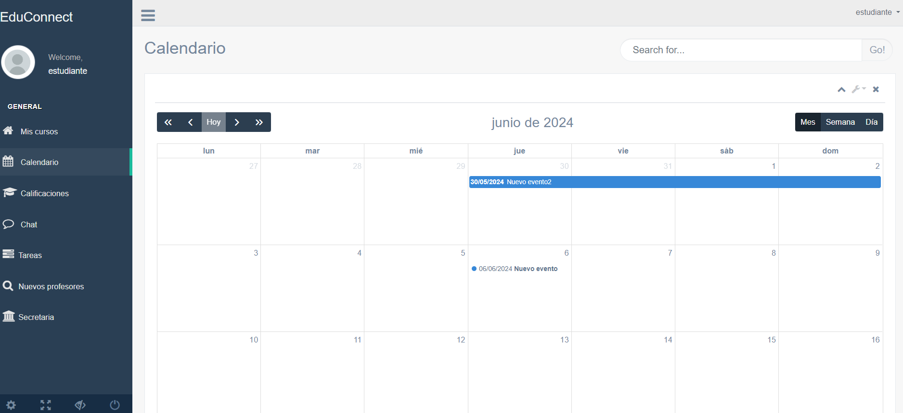
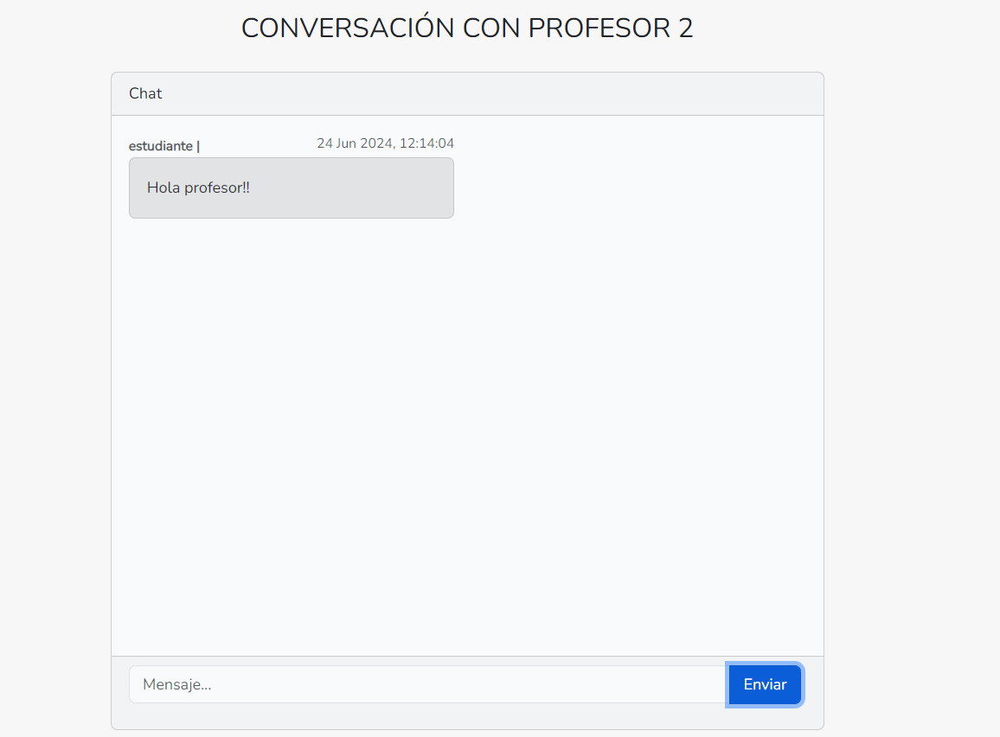
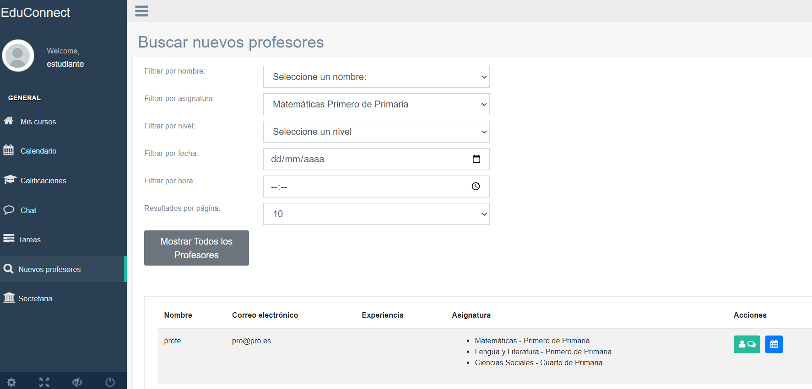

# Proyecto Integrado del Ciclo Formativo de DAM

**Educonnect** es una aplicación web para clases particulares online, desarrollada en Laravel. Sus principales funcionalidades son:

- **Registro de Usuarios**: Estudiantes y profesores pueden registrarse. Los profesores deben seleccionar las asignaturas que imparten durante el registro.
- **Comunicación**: Profesores y estudiantes pueden comunicarse a través de un chat integrado.
- **Gestión de Tutorías**: Tanto profesores como estudiantes pueden gestionar tutorías programadas mediante un calendario interactivo, utilizando la librería FullCalendar.
  El sistema permite crear, leer, actualizar y eliminar eventos (CRUD). Además, se envían correos electrónicos de recordatorio para los eventos programados.
- **Búsqueda de Profesores**: Los estudiantes pueden buscar y filtrar profesores por nombre, asignatura, curso, fecha y hora.
- **Personalización de Perfil**: Todos los usuarios pueden personalizar su perfil añadiendo una foto.

## Capturas de pantalla

### Landing Page

### Login

### Mis cursos

### Calendario

### Chat

### Búsqueda de profesores

